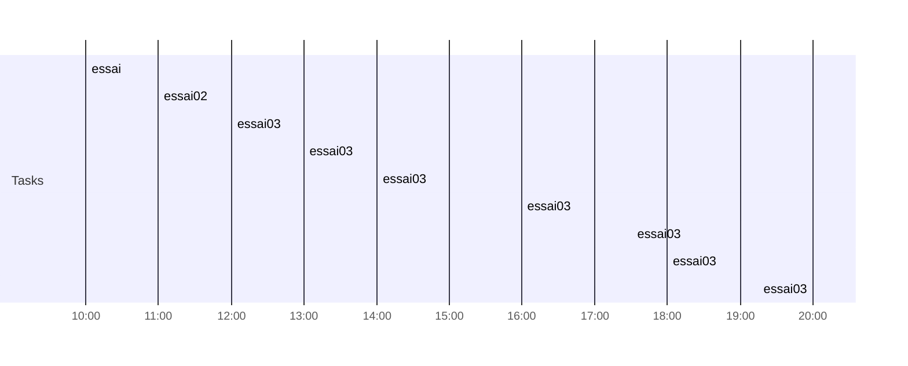

# Day Planner-20230814
## Day Planner

- [x] 10:00 essai
- [x] 11:00 essai02
- [x] 12:00 essai03
- [x] 13:00 essai03
- [x] 14:00 essai03
- [x] 16:00 essai03
- [x] 17:30 essai03
- [x] 18:00 essai03
- [x] 20:00 essai03

